# 🏗️ Tech Lead Out: Direcionamento Técnico Operacional

> **Fonte Única da Verdade**: `.ai/architect-out/architect.md`
>
> **Objetivo**: Transformar arquitetura em direcionamento técnico operacional altamente estruturado, consistente e consumível pelos agentes posteriores.

---

## 📋 Visão Geral Técnica

### Arquitetura de Alto Nível

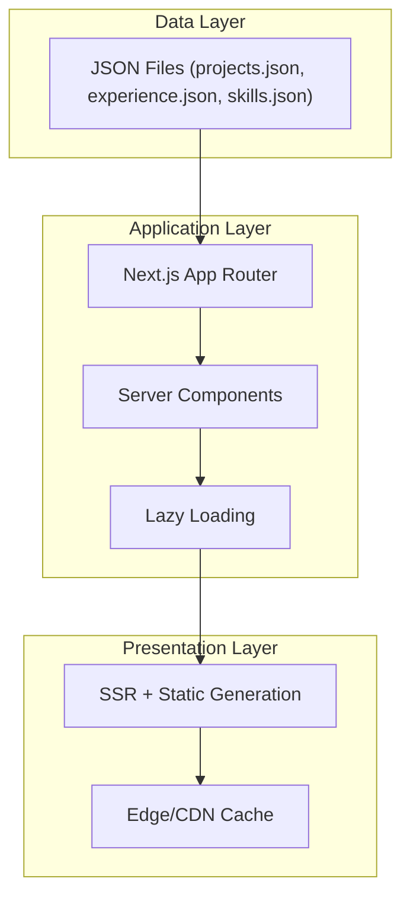

### Boundaries Arquiteturais

#### External Boundaries

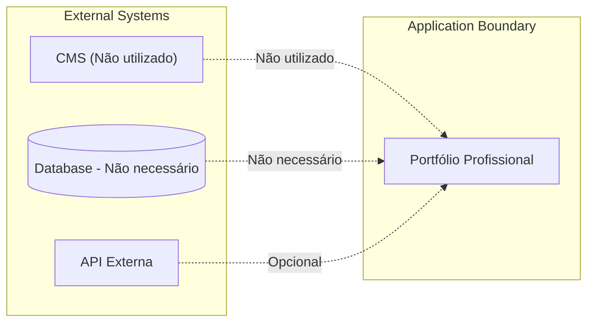

#### Internal Boundaries

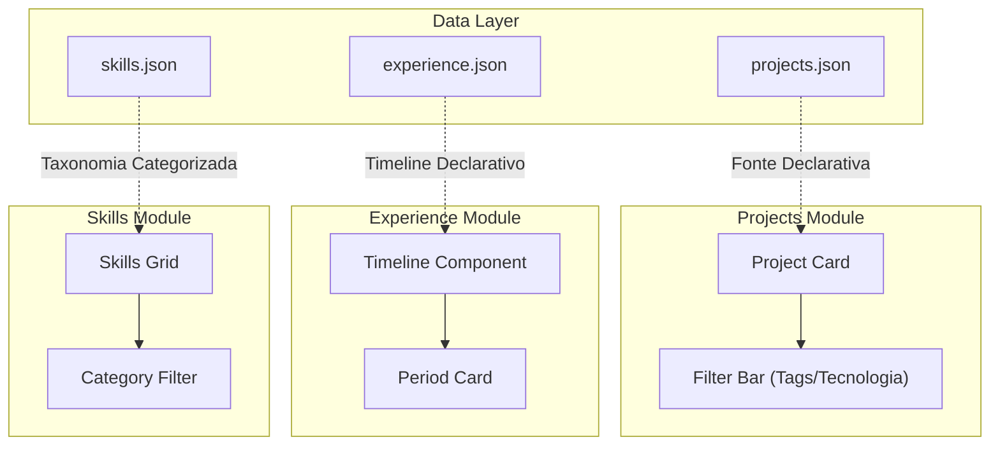

---

## 📦 Módulos Principais

### Módulo: `projects` (Grid de Projetos)

#### Responsabilidades
- Renderizar grid responsivo de projetos técnicos
- Filtrar por tecnologias/tags
- Lazy loading de imagens com placeholders otimizados
- Exibir metadados técnicos e links externos

#### Boundaries Internos

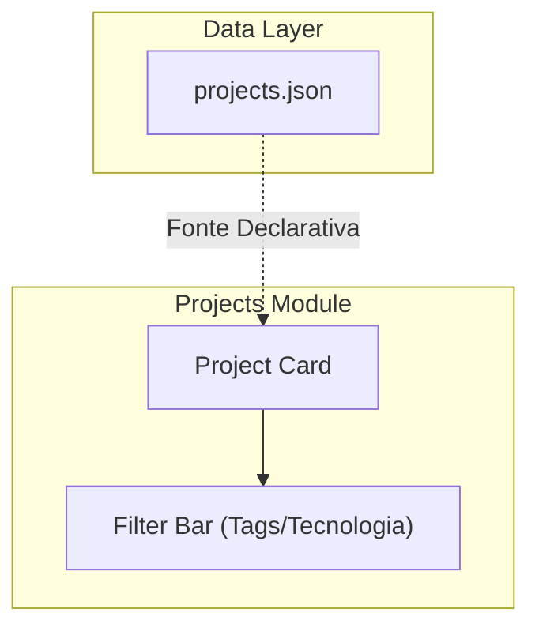

#### Estrutura de Dados

```typescript
interface Project {
  id: string;              // Unique identifier
  title: string;           // Título do projeto
  description: string;     // Descrição técnica concisa
  technologies: string[];  // Tags/tecnologias
  links: {                 // Links externos
    github?: string;
    demo?: string;
    documentation?: string;
  };
  image?: string;          // URL da imagem (lazy-loaded)
}
```

---

### Módulo: `experience` (Timeline Profissional)

#### Responsabilidades
- Renderizar timeline cronológica de carreira
- Exibir períodos, responsabilidades e impacto técnico
- Visualização vertical com scroll suave

#### Boundaries Internos

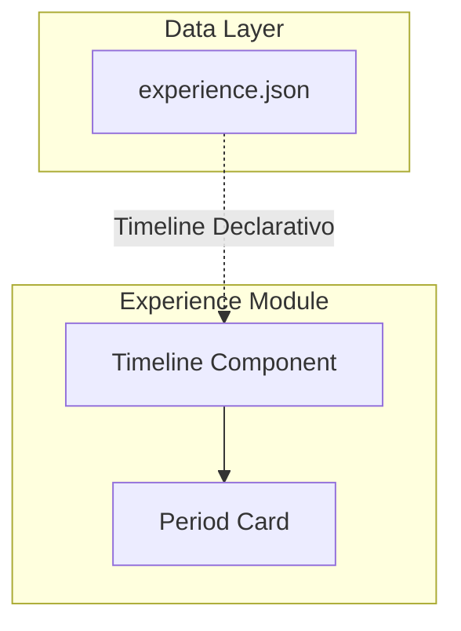

#### Estrutura de Dados

```typescript
interface Experience {
  id: string;              // Unique identifier
  periods: Array<{
    company: string;
    role: string;
    startDate?: string;
    endDate?: string;
    description: string;
    technologies?: string[];
  }>;
}
```

---

### Módulo: `skills` (Taxonomia de Habilidades)

#### Responsabilidades
- Exibir habilidades categorizadas por domínio
- Filtros por área técnica
- Visualização clara e legível

#### Boundaries Internos

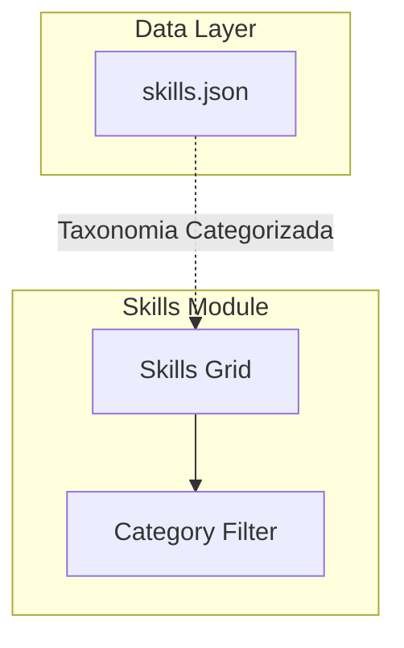

#### Estrutura de Dados

```typescript
interface Skills {
  id: string;              // Unique identifier
  categories: Array<{
    domain: string;        // Domínio (ex: Frontend, Backend)
    skills: string[];      // Habilidades específicas
    level?: 'beginner' | 'intermediate' | 'expert';
  }>;
}
```

---

### Módulo: `layout` (Wrapper de Layout)

#### Responsabilidades
- Estrutura base do layout do portfólio
- Dark mode como padrão com toggle persistente
- Responsive breakpoints semânticos
- Acessibilidade WCAG 2.1 AA

#### Boundaries Internos

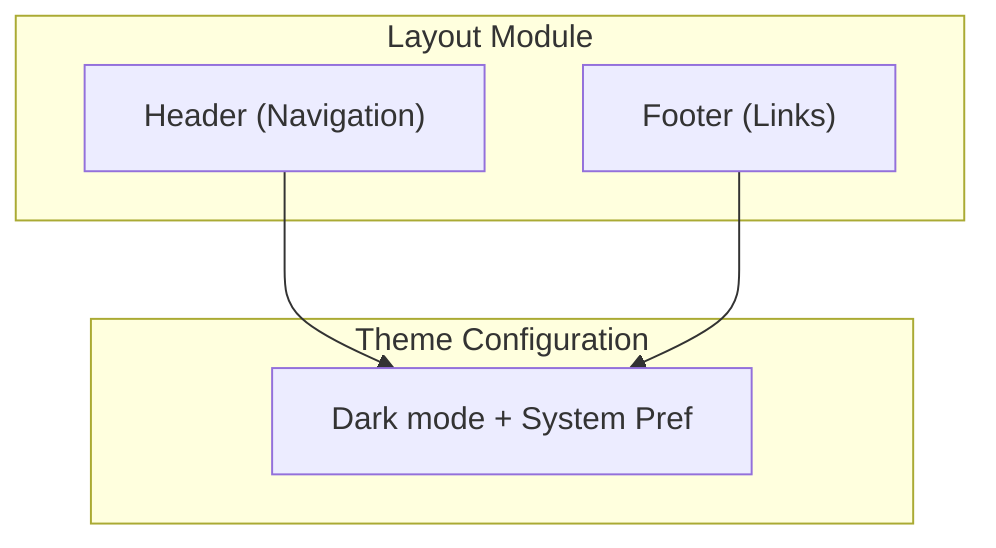

---

## 🔄 Fluxos Conceituais

### Fluxo de Renderização

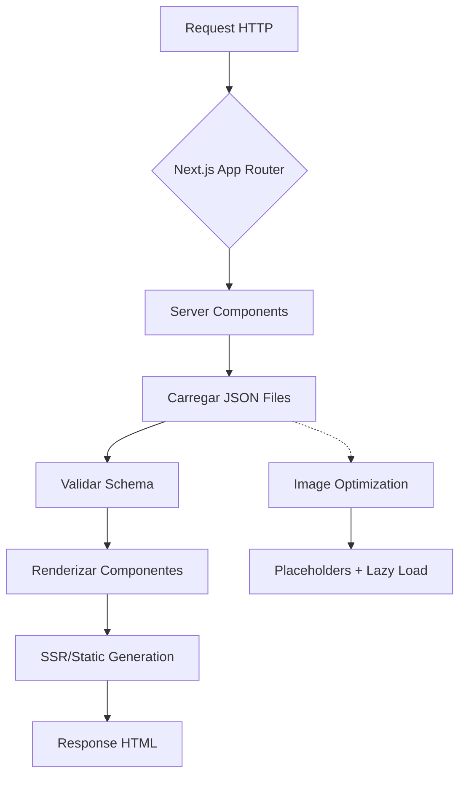

### Fluxo de Dados

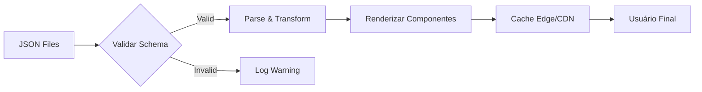

### Fluxo de Atualização de Conteúdo

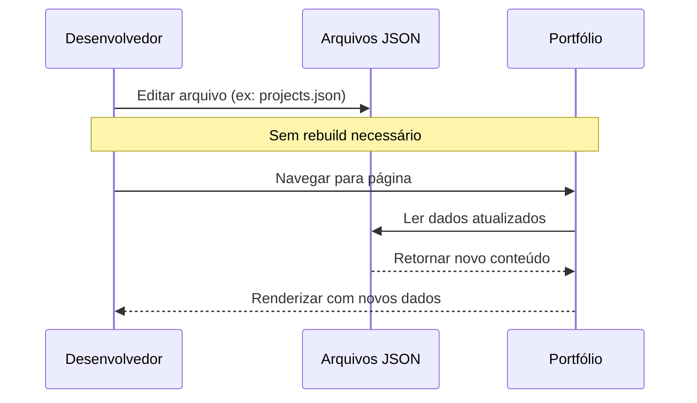

---

## 🎯 Estratégia Arquitetural

### Decisões de Design

| Decisão | Racional | Impacto |
|---------|----------|----------|
| **Server Components First** | Minimiza JavaScript no cliente, melhora performance e SEO | Alto |
| **JSON como Fonte Única** | Elimina necessidade de CMS ou banco de dados complexo | Médio |
| **SSR + Static Generation** | Máxima performance com cache edge/CDN | Alto |
| **Dynamic Metadata** | SEO otimizado por página e projeto individualmente | Médio |
| **Lazy Loading Agressivo** | Carrega apenas o necessário para viewport atual | Alto |

### Trade-offs Aceitos

```
┌─────────────────────────────────────────────────────┐
│              TRADE-OFFS ARQUITETURAIS                  │
 ├─────────────────────────────────────────────────────┤
 │                                                       │
 │  ✅ SIMPLIFICADO                                    │
 │     └── Não usar CMS/headless CMS                    │
 │         → Perde: Automação de conteúdo                │
 │         → Ganha: Controle total, zero overhead        │
 │                                                       │
 │  ⚠️ LIMITADO                                         │
 │     └── JSON local como fonte de dados               │
 │         → Perde: Multi-user collaboration             │
 │         → Ganha: Simplicidade extrema                 │
 │                                                       │
 │  ✅ OTIMIZADO                                       │
 │     └── SSR + Static Generation                     │
 │         → Perde: Dinamismo em tempo real              │
 │         → Ganha: Performance máxima, SEO perfeito    │
 │                                                       │
 └─────────────────────────────────────────────────────┘
```

---

## 📊 Estratégia de Dados

### Fonte Única da Verdade

```bash
portfolio-profissional-2026/
├── src/
│   ├── data/
│   │   ├── projects.json      # Portfólio técnico
│   │   ├── experience.json    # Timeline profissional
│   │   └── skills.json        # Taxonomia de habilidades
│   └── ...
```

### Schema Validation

```typescript
// Validador de schema antes da renderização
function validateProject(project: unknown): asserts project is Project {
  const schema = {
    required: ['id', 'title', 'description'],
    properties: {
      id: { type: 'string' },
      title: { type: 'string' },
      description: { type: 'string' },
      technologies: { type: 'array', items: { type: 'string' } },
      links: { type: 'object' },
    },
  };
  
  // Implementação de validador (ex: zod, yup)
}
```

### Lazy Loading de Dados

```typescript
// Carregamento progressivo por viewport
const DATA_CHUNK_SIZE = 10;  // Itens por carregamento

function loadProjects(page: number) {
  const start = (page - 1) * DATA_CHUNK_SIZE;
  return projects.slice(start, start + DATA_CHUNK_SIZE);
}
```

---

## ⚠️ Riscos e Mitigações

### Matriz de Riscos

| Risco | Probabilidade | Impacto | Mitigação |
|-------|--------------|---------|------------|
| **JSON mal formatado** | Baixa | Médio | Schema validation antes renderizar |
| **Imagens não otimizadas** | Média | Alto | Next.js Image API + placeholders |
| **Expansão futura complexa** | Baixa | Baixo | Arquitetura modular desde início |
| **Performance degradada** | Baixa | Médio | Web Vitals no build process |

### Plano de Contingência

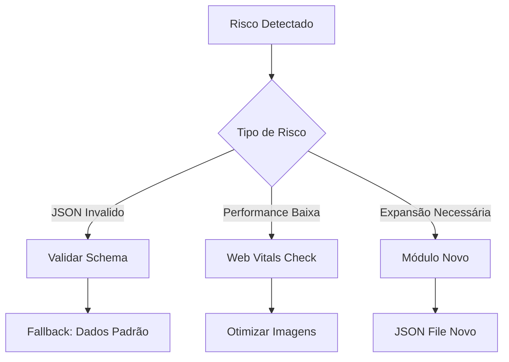

---

## 🚀 Estratégia de Escalabilidade

### Horizontal Scaling (Nativo)

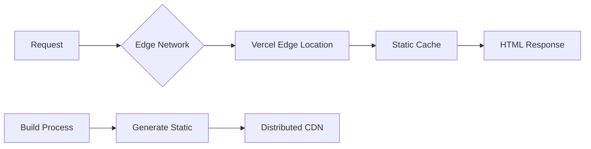

### Vertical Scaling (Via JSON)

```typescript
// Estrutura escalável para novos módulos
interface Module {
  id: string;
  name: string;
  schema: SchemaDefinition;  // Definição de dados
  component: ComponentType;  // Renderizador
}

const MODULES: Record<string, Module> = {
  projects: { /* ... */ },
  experience: { /* ... */ },
  skills: { /* ... */ },
  // Adicionar novos módulos sem alterar código
};
```

---

## 🛠️ Estratégia de Manutenção

### Atualização de Conteúdo

```bash
# Fluxo recomendado para atualizar conteúdo
1. Editar arquivo JSON (ex: projects.json)
2. Validar schema manualmente ou via tooling
3. Navegar ao conteúdo na aplicação
4. Renderizado automático sem rebuild
```

### Checklist de Manutenção

- [ ] Validar JSON files antes commit
- [ ] Monitorar Web Vitals no build
- [ ] Testar em dispositivos móveis reais
- [ ] Revisar schema quando adicionar novo módulo
- [ ] Limpar cache de navegador periodicamente

---

## 🔮 Expansão Futura

### Roadmap de Expansão

| Fase | Módulo Adicional | JSON File |
|------|------------------|------------|
| 1 | Blog Técnico | `posts.json` |
| 2 | Documentação | `docs/` (MDX) |
| 3 | Internacionalização | `locales/*.json` |
| 4 | Automação IA | Geração de conteúdo |

### Estrutura Preparada para Expansão

```bash
src/
├── data/
│   ├── projects.json      # ✅ Existente
│   ├── experience.json    # ✅ Existente
│   ├── skills.json        # ✅ Existente
│   └── posts.json         # 📦 Pronto para uso
├── app/
│   ├── blog/
│   │   └── page.tsx       # 📦 Componente pronto
│   └── docs/
│       └── page.tsx       # 📦 Componente pronto
```

---

## 📝 Decisões Arquiteturais Consolidadas

### DAD (Decisions As Data)

```typescript
const ARCHITECTURAL_DECISIONS = {
  // DECISÃO 001: JSON como fonte única da verdade
  id: 'DAD-001',
  title: 'JSON as Single Source of Truth',
  decision: 'Utilizar arquivos JSON locais como fonte exclusiva de dados',
  rationale: 'Elimina CMS overhead, simplifica manutenção, permite controle total',
  status: 'APPROVED',
  
  // DECISÃO 002: Server Components First
  id: 'DAD-002',
  title: 'Server Components Priority',
  decision: 'Priorizar Server Components em todas as páginas',
  rationale: 'Minimiza JavaScript no cliente, melhora performance e SEO',
  status: 'APPROVED',
  
  // DECISÃO 003: SSR + Static Generation
  id: 'DAD-003',
  title: 'Rendering Strategy',
  decision: 'SSR para páginas dinâmicas, Static para conteúdo fixo',
  rationale: 'Balanceia performance com dinamismo necessário',
  status: 'APPROVED',
};
```

---

## 📊 Métricas de Qualidade

### Lighthouse Targets

| Métrica | Target Mínimo | Status |
|---------|---------------|--------|
| Performance | ≥ 95 | ✅ Definido |
| Accessibility | ≥ 90 | ✅ WCAG 2.1 AA |
| Best Practices | ≥ 90 | ✅ Definido |
| SEO | ≥ 90 | ✅ Dynamic Metadata |

### Web Vitals Targets

```typescript
const WEB_VITALS_TARGETS = {
  LCP: { target: '2.5s', description: 'Largest Contentful Paint' },
  FID: { target: '100ms', description: 'First Input Delay' },
  CLS: { target: '0.1', description: 'Cumulative Layout Shift' },
};
```

---

## 📋 Checklist de Arquitetura

### Pré-Implementação

- [x] Planner analisado integralmente
- [x] Boundaries definidos claramente
- [x] Módulos identificados e documentados
- [x] Fluxos conceituais mapeados
- [ ] Schema JSONs criados (Fase 1)
- [ ] Componentes core implementados (Fase 2)

### Pós-Arquitetura

- [ ] Documentação persistida em `.ai/architect-out/architect.md`
- [ ] Nenhum artefato executável criado
- [ ] Decisões registradas no DAD
- [ ] Métricas de qualidade definidas

---

## 📖 Histórico de Versão

| Versão | Data | Autor | Mudanças |
|--------|------|-------|----------|
| 1.0.0 | 2026-05-09 | Architect Agent | Documentação inicial baseada no planner |

---

*Documento gerado exclusivamente para documentação arquitetural.*
*Nenhuma implementação, scaffold ou execução foi iniciada.*