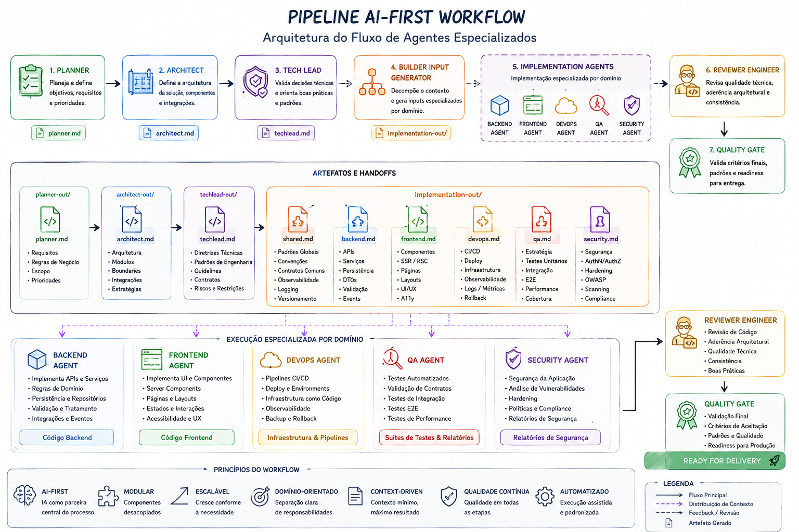

# base-workflow

> Estrutura de workflow AI-First orientada por agentes especializados para planejamento, arquitetura, direcionamento técnico, decomposição operacional e implementação de software.

---

# 🚀 Objetivo

O `base-workflow` tem como objetivo padronizar um pipeline de desenvolvimento orientado por IA, onde cada agente possui responsabilidades explícitas, boundaries claros e outputs consumíveis pelos agentes subsequentes.

A proposta é transformar o desenvolvimento de software em uma cadeia coordenada de agentes especializados, reduzindo ambiguidades, aumentando consistência arquitetural e acelerando entregas técnicas com qualidade previsível.

O workflow foi projetado para:

- reduzir acoplamento entre etapas
- minimizar contexto desnecessário
- facilitar execução multi-agente
- permitir escalabilidade do pipeline
- estruturar handoff técnico entre agentes
- preparar contexto otimizado para AI Coding Agents

---

# 🧠 Pipeline AI-First

```text
planner
   ↓
architect
   ↓
tech-lead
   ↓
builder-input-generator
   ↓
implementation-agents
   ↓
reviewer-engineer
   ↓
quality-gate
```

---

# 🏗️ Visão Geral do Pipeline

| Etapa                   | Objetivo Principal                                            |
| ----------------------- | ------------------------------------------------------------- |
| Planner                 | Estruturar requisitos, regras de negócio e escopo             |
| Architect               | Definir arquitetura, módulos, boundaries e decisões técnicas  |
| Tech Lead               | Consolidar padrões de engenharia e direcionamento operacional |
| Builder Input Generator | Quebrar contexto técnico em inputs especializados por agente  |
| Implementation Agents   | Implementar cada domínio técnico isoladamente                 |
| Reviewer Engineer       | Validar qualidade técnica e aderência arquitetural            |
| Quality Gate            | Validar consistência final, padrões e readiness               |

---

# 📦 Estrutura do Workflow

```text
.ai/
├── planner-out/
├── architect-out/
├── techlead-out/
├── implementation-out/
│   ├── shared.md
│   ├── backend.md
│   ├── frontend.md
│   ├── devops.md
│   ├── qa.md
│   └── security.md
│
├── templates/
│   ├── planner-template.md
│   ├── architect-template.md
│   ├── techlead-template.md
│   └── builder-input-template.md
│
├── actions/
│   ├── action-planner.md
│   ├── action-architect.md
│   ├── action-techlead.md
│   └── action-builder-input-generator.md
│
└── agents/
    ├── planner.md
    ├── architect.md
    ├── tech-lead.md
    └── builder-input-generator.md
```

---

# 🧩 Filosofia Arquitetural

O projeto segue princípios:

- AI-First
- Declarativo
- Modular
- Escalável
- Context-Driven
- Domain-Oriented
- Boundary-Oriented
- Multi-Agent Ready
- Low Context Noise
- Semantic Parsing Friendly

---

# 🔄 Estratégia do Workflow

O pipeline foi projetado para funcionar em múltiplas camadas de refinamento.

## 1. Planejamento

O Planner:

- interpreta requisitos
- organiza escopo
- consolida regras de negócio
- estrutura visão funcional

Output:

```text
planner.md
```

---

## 2. Arquitetura

O Architect:

- transforma planejamento em arquitetura
- define boundaries
- define módulos
- define integrações
- define estratégias técnicas

Output:

```text
architect.md
```

---

## 3. Direcionamento Técnico

O Tech Lead:

- revisa coerência arquitetural
- consolida padrões
- define guidelines
- reduz ambiguidades técnicas
- prepara handoff operacional

Output:

```text
techlead.md
```

---

## 4. Decomposição Operacional

O Builder Input Generator:

- lê diretamente o `techlead.md`
- separa responsabilidades por domínio
- minimiza contexto por agente
- gera inputs especializados

Outputs:

```text
implementation-out/
  backend.md
  frontend.md
  devops.md
  qa.md
  security.md
  shared.md
```

---

## 5. Implementação Especializada

Os Implementation Agents:

- consomem apenas seu contexto especializado
- seguem boundaries definidos
- respeitam contratos e padrões
- implementam somente sua responsabilidade

Exemplo:

| Agente         | Responsabilidade                       |
| -------------- | -------------------------------------- |
| Backend Agent  | APIs, domínio, persistência            |
| Frontend Agent | UI, SSR, componentes                   |
| DevOps Agent   | CI/CD, observabilidade, infraestrutura |
| QA Agent       | Estratégia de testes                   |
| Security Agent | Segurança e compliance                 |

---

# 📌 Status Atual do Projeto

| Agente / Etapa          | Responsabilidade             | Status                |
| ----------------------- | ---------------------------- | --------------------- |
| Planner                 | Requisitos e escopo          | ✅ Implementado       |
| Architect               | Arquitetura e boundaries     | ✅ Implementado       |
| Tech Lead               | Direcionamento operacional   | ✅ Implementado       |
| Builder Input Generator | Decomposição operacional     | ✅ Implementado       |
| Backend Agent           | Implementação backend        | 🚧 Em desenvolvimento |
| Frontend Agent          | Implementação frontend       | 🚧 Em desenvolvimento |
| DevOps Agent            | Infraestrutura e CI/CD       | 🚧 Em desenvolvimento |
| QA Agent                | Estratégia de testes         | 🚧 Em desenvolvimento |
| Security Agent          | Segurança e compliance       | 🚧 Em desenvolvimento |
| Reviewer Engineer       | Revisão técnica automatizada | 🚧 Planejado          |
| Quality Gate            | Validação final do pipeline  | 🚧 Planejado          |

---

# 🧠 Estratégia de Context Engineering

O workflow foi desenhado para minimizar custo de contexto em LLMs.

## Estratégia utilizada

- parsing semântico progressivo
- handoff declarativo
- separação por domínio
- boundaries explícitos
- responsabilidades isoladas
- outputs especializados
- documentos consumíveis por IA

---

# ⚙️ Estratégia de Persistência

Todos os agentes seguem regras rígidas:

- persistência apenas via tool oficial `write`
- sem shell
- sem bash
- sem heredoc
- sem filesystem manual
- sem append incremental

Cada documento deve:

- ser gerado completamente em memória
- validado antes da persistência
- escrito em única operação

---

# 📊 Workflow Visual




---

# 🔥 Roadmap

## Fase 1 — Planejamento Arquitetural

- [x] Planner
- [x] Architect

---

## Fase 2 — Governança Técnica

- [x] Tech Lead
- [x] Builder Input Generator
- [ ] Reviewer Engineer
- [ ] Quality Gate

---

## Fase 3 — Implementação Especializada

- [ ] Backend Agent
- [ ] Frontend Agent
- [ ] DevOps Agent
- [ ] QA Agent
- [ ] Security Agent

---

## Fase 4 — Orquestração Inteligente

- [ ] Execução multi-agente
- [ ] Orquestração automática
- [ ] Memory/context management
- [ ] Parallel agent execution
- [ ] Incremental quality validation

---

## Fase 5 — Plataforma AI Engineering

- [ ] Integração CI/CD
- [ ] Observabilidade dos agentes
- [ ] Métricas de qualidade
- [ ] Agent telemetry
- [ ] Auto-remediation
- [ ] AI Governance Layer

---

# 🎯 Objetivos de Longo Prazo

O `base-workflow` busca evoluir para uma plataforma de:

- engenharia de software AI-native
- desenvolvimento multi-agente
- geração arquitetural automatizada
- governança técnica orientada por IA
- execução coordenada de pipelines inteligentes

---

# 📜 Licença

MIT
