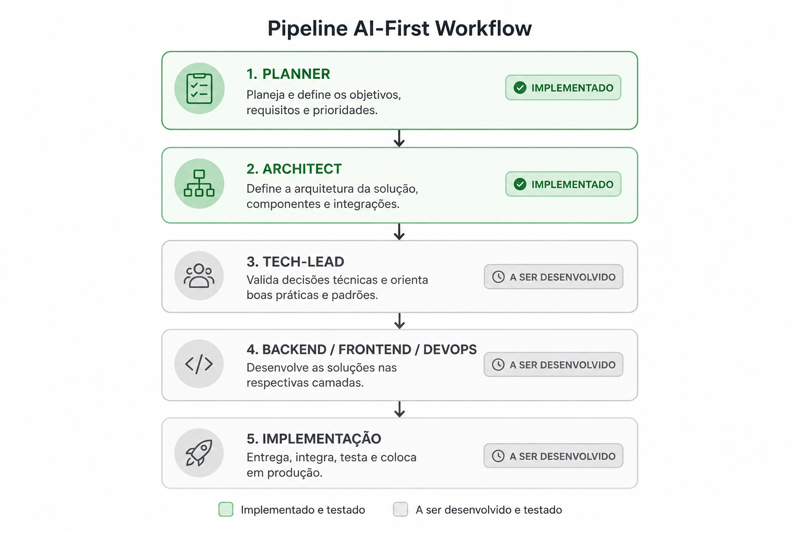

# base-workflow

> Estrutura de workflow AI-First orientada por agentes especializados para planejamento, arquitetura, validação técnica e implementação de software.

---

## 🚀 Objetivo

O `base-workflow` tem como objetivo padronizar um pipeline de desenvolvimento orientado por IA, onde cada agente possui uma responsabilidade clara dentro do ciclo de construção da solução.

A proposta é transformar o processo de desenvolvimento em uma cadeia colaborativa de agentes especializados, reduzindo ambiguidades, acelerando entregas e aumentando a qualidade técnica desde a concepção até a implementação.

---

# 🧠 Pipeline AI-First

```text
planner
   ↓
architect
   ↓
tech-lead
   ↓
backend/frontend/devops
   ↓
implementação
```

---

## 📌 Status Atual do Projeto

| Agente                      | Responsabilidade                                          | Status                     |
| --------------------------- | --------------------------------------------------------- | -------------------------- |
| Planner                     | Levantamento de requisitos, escopo e regras de negócio    | ✅ Implementado e validado |
| Architect                   | Definição arquitetural, padrões e estrutura técnica       | ✅ Implementado e validado |
| Tech Lead                   | Revisão técnica, qualidade e direcionamento de engenharia | 🚧 Em desenvolvimento      |
| Backend / Frontend / DevOps | Implementação especializada por camada                    | 🚧 Em desenvolvimento      |
| Implementação               | Execução final e integração da solução                    | 🚧 Em desenvolvimento      |

# 🏗️ Filosofia do Projeto

Este projeto segue uma abordagem:

- AI-First
- Modular
- Escalável
- Orientada a domínio
- Baseada em responsabilidades claras
- Preparada para múltiplos agentes colaborativos

---

# 📊 Workflow Visual



---

# 🔥 Roadmap

## Fase 1

- [x] Planner
- [x] Architect

## Fase 2

- [ ] Tech Lead
- [ ] Reviewer Engineer
- [ ] Quality Gate

## Fase 3

- [ ] Backend Agent
- [ ] Frontend Agent
- [ ] DevOps Agent

## Fase 4

- [ ] Automação completa do pipeline
- [ ] Execução multi-agente
- [ ] Integração com CI/CD
- [ ] Observabilidade dos agentes

---

# 📜 Licença

MIT
